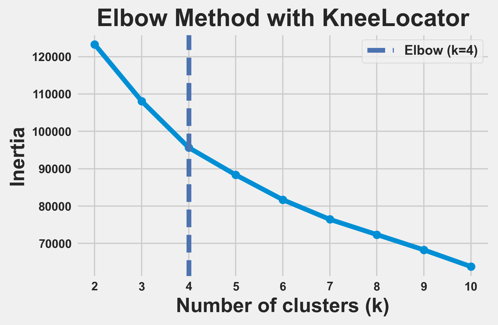
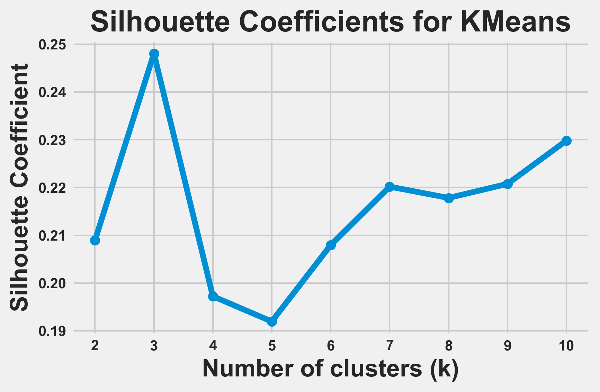
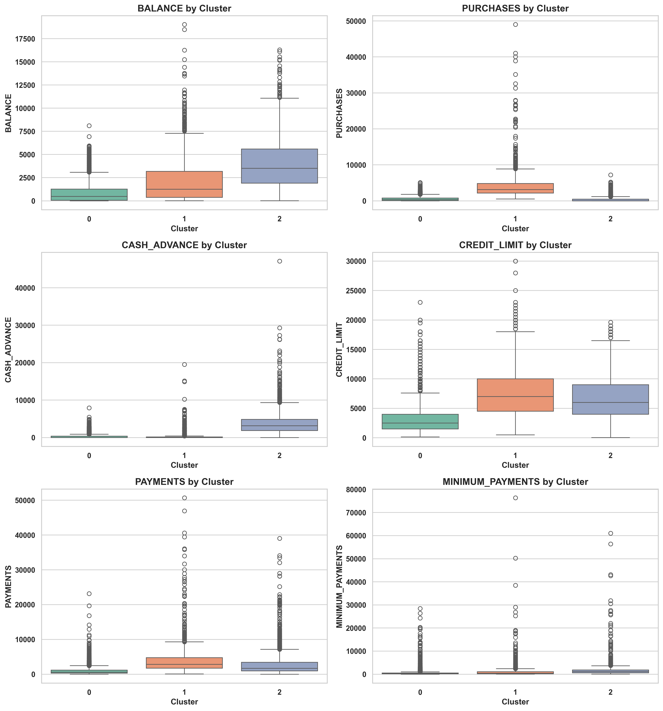

# Customer Segmentation with Clustering

Unsupervised customer segmentation using **K-Means, Gaussian Mixture Models (GMM), and DBSCAN** on customer financial-behavior features. The project compares clustering strategies, evaluates cluster quality, and interprets customer groups through exploratory analysis and visualization.

## Project Highlights

- Performed exploratory analysis on **8,950 customer records** and 18 original columns.
- Removed rows with missing `MINIMUM_PAYMENTS` or `CREDIT_LIMIT` values because missingness was below 5%.
- Excluded `CUST_ID` from clustering so the identifier could not influence similarity calculations.
- Standardized numerical features before clustering.
- Compared **K-Means**, **Gaussian Mixture Models**, and **DBSCAN**.
- Used both the **Elbow Method** and **Silhouette Score** to choose K-Means cluster count.
- Built an interactive **Tkinter** visualization in the original notebook for exploring K-Means clusters across feature pairs.

## Key Results

| Method | Selected configuration | Main result |
|---|---|---|
| K-Means | `k = 3` | Highest tested K-Means silhouette: **0.2480** |
| GMM | `n_components = 2` | Best tested GMM silhouette: **0.1940** |
| DBSCAN | `eps = 0.6`, `min_samples = 20` | Silhouette: **0.4340**, but **6,830 points** were labeled as noise |

The elbow detector suggested `k = 4`, but `k = 3` produced the strongest K-Means silhouette score (`0.2480` vs. `0.1972` for `k = 4`), so the project selected **3 customer segments** as the final K-Means solution.

DBSCAN achieved a higher silhouette score on non-noise points, but its best tested configuration classified 6,830 observations as noise. For this reason, it was treated mainly as an **outlier/anomaly detection signal** rather than the primary segmentation method.

## Visual Results

### K-Means Elbow Method



### K-Means Silhouette Scores



### Cluster Profiles



## Workflow

1. Load and inspect customer data.
2. Check missing values and basic data quality constraints.
3. Remove the customer identifier from modeling features.
4. Explore feature distributions, skewness, relationships, and correlations.
5. Standardize numeric features using `StandardScaler`.
6. Evaluate K-Means for `k = 2...10` using inertia and silhouette score.
7. Compare K-Means with GMM and DBSCAN.
8. Interpret the final customer groups with feature-level visualizations.

## Repository Structure

```text
customer-segmentation-clustering/
├── assets/                    # Visualizations exported from the notebook
├── data/
│   └── README.md              # Dataset placement instructions
├── notebooks/
│   └── customer_segmentation_analysis.ipynb
├── results/                   # Model-comparison tables
├── src/
│   └── clustering_pipeline.py # Reusable clustering utilities
├── .gitignore
├── README.md
└── requirements.txt
```

## Tech Stack

`Python` · `Pandas` · `NumPy` · `Scikit-learn` · `Matplotlib` · `Seaborn` · `Kneed` · `Tkinter`

## Running the Project

1. Clone the repository.
2. Install dependencies:

```bash
pip install -r requirements.txt
```

3. Place `Customer_Data.csv` in the expected location or update the notebook's file path.
4. Run `notebooks/customer_segmentation_analysis.ipynb`.

## Notes

The public repository does not include the raw dataset. The `results/` directory contains the aggregate evaluation tables used to compare clustering configurations.
